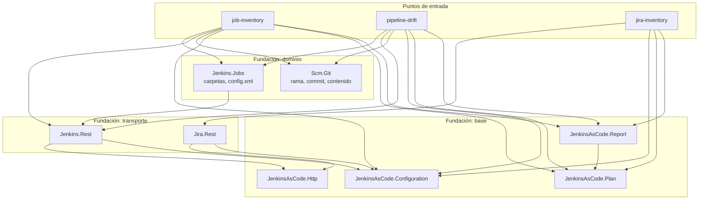

# Arquitectura

**Propósito.** Describir las capas, la regla que gobierna las dependencias entre ellas,
y el ciclo de vida que sigue toda automatización.

**Alcance.** Estructura. El comportamiento de cada módulo está en su propia guía.

**Documentos relacionados**

- [automation-contract.md](automation-contract.md) — qué debe traer un módulo nuevo
- [command-model.md](command-model.md) — el ciclo de vida en detalle
- [ADR 0003](../adr/0003-shared-http-layer.md) — por qué el HTTP es compartido

## 1. Capas



| Capa | Contiene | Nunca contiene |
| --- | --- | --- |
| **Puntos de entrada** (`automations/*/Invoke-*.ps1`) | La superficie de comandos y las reglas de una familia de recursos. | Nada que necesite otra automatización. |
| **Dominio** (`Jenkins.Jobs`, `Scm.Git`) | Cómo leer una parte de un sistema, con seguridad. | Qué jobs existen en un cliente. |
| **Transporte** (`Jenkins.Rest`, `Jira.Rest`) | Lo específico de un sistema: rutas, endpoints, qué significa un 403 ahí. | Retry, redirects, decodificación: eso es genérico. |
| **Base** (`JenkinsAsCode.*`) | Configuración, HTTP de sólo lectura, modelo de plan, evidencia. | Cualquier conocimiento sobre Jenkins o Jira. |

## 2. La regla de dependencias

**Las dependencias apuntan hacia abajo, nunca a los lados ni hacia arriba.**

| Permitido | Prohibido |
| --- | --- |
| Un punto de entrada llama a módulos de dominio, de transporte y de base. | Un punto de entrada llama a otro punto de entrada. |
| Un módulo de dominio llama a su transporte. | Un módulo de dominio llama a otro módulo de dominio. |
| Un transporte llama a la base. | Un transporte llama a otro transporte. |
| La base no llama a nada, salvo `Report` a `Plan`. | La base llama hacia arriba. |

`JenkinsAsCode.Configuration`, `.Http` y `.Plan` **no dependen de nada**, así que nada
puede ciclar a través de ellos. `.Report` es la única excepción declarada: depende de
`.Plan`, y por eso el subgrafo se llama «base» y no «sin dependencias» — el rótulo decía
lo segundo mientras contenía a `.Report`, y el propio diagrama dibujaba esa arista doce
líneas más abajo. Ese es el orden en que `Import-Foundation.ps1` los carga:
cargar fuera de orden hace que `RequiredModules` reporte un error de resolución que nombra
el módulo equivocado.

### Dónde va lo que se agrega

| Se agrega | Va en |
| --- | --- |
| Una capacidad sobre una familia de recursos que ya existe | El punto de entrada de esa automatización |
| Una capacidad sobre una familia nueva | Una automatización **nueva** |
| Algo que necesitan todas las automatizaciones | El módulo de `foundation/` que corresponda |
| Algo que necesita una sola, pero puesto en código compartido | En ningún lado. Va en esa automatización. |

La última fila es el punto de presión. Si la capa compartida parece necesitar un caso
especial para tu módulo, la lógica es de tu módulo.

Dos cosas se movieron a la base **por esta regla**, no a pesar de ella: el lector de
variables de entorno obligatorias y toda la mecánica de HTTP. Hay dos transportes acá, y
una regla implementada dos veces es una regla que se desincroniza. Ver
[ADR 0003](../adr/0003-shared-http-layer.md).

## 3. La división que hace testeable lo peligroso

Todo módulo de dominio tiene dos mitades, y la separación es deliberada:

**La mitad impura** recorre el sistema y trae documentos. Es delgada.

**La mitad pura** convierte un documento en un objeto, o dos textos en un veredicto.
Toma **cadenas**, no URLs. Ahí vive todo el conocimiento.

Esa forma vino primero, y la suite de tests es su consecuencia, no un agregado. La excusa
habitual de los scripts de infraestructura —"esto sólo se puede probar de verdad contra el
sistema vivo"— es cierta de las peticiones y falsa de todo lo que vale la pena probar.
`ConvertFrom-JenkinsJobConfigXml` y `Compare-ScmText` se prueban con fixtures inventados,
sin controller, sin token y sin red.

## 4. Ciclo de vida

```text
validate -> inventory -> plan -> smoke
```

Ningún peldaño escribe. La escalera termina en `plan` porque no existe `apply`: ver
[ADR 0001](../adr/0001-read-only-by-construction.md) y
[scope-and-limits.md](../overview/scope-and-limits.md).
